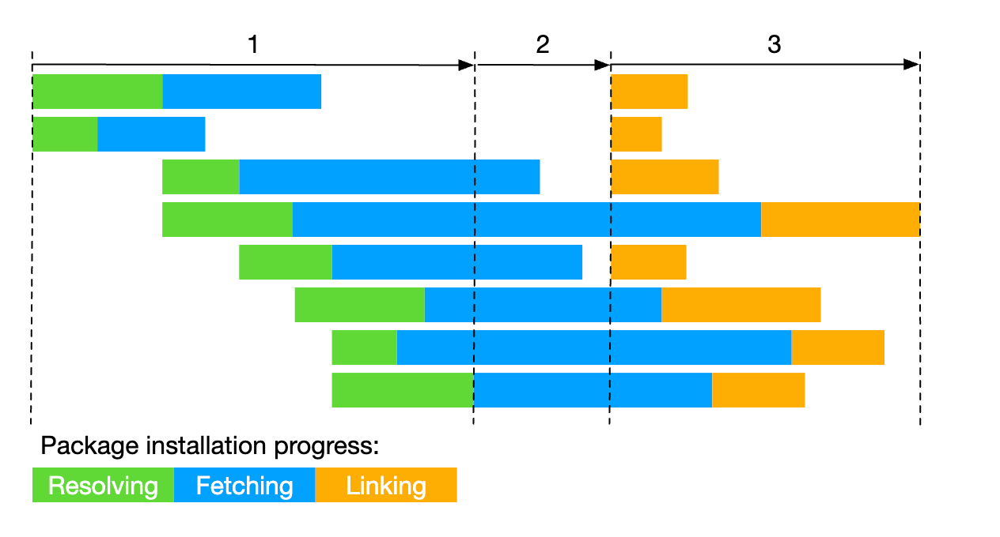
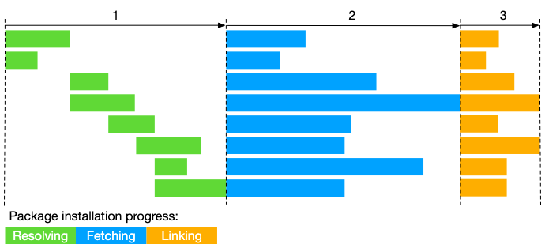

# pnpm Basics
The main motivation to use `pnpm` is to save disk space and faster installations. The default `npm` installation always copies all `node_modules` in each project to the disk.

When using `npm`, if you have 100 projects using a dependency, you will have 100 copies of that dependency saved on disk. With `pnpm`, the dependency will be stored in a content-addressable store, so:

1. If you depend on different versions of the dependency, only the files that differ are added to the store. For instance, if it has 100 files, and a new version has a change in only one of those files, `pnpm update` will only add 1 new file to the store, instead of cloning the entire dependency just for the singular change.
2. All the files are saved in a single place on the disk. When packages are installed, their files are hard-linked from that single place, consuming no additional disk space. This allows you to share dependencies of the same version across projects.

`pnpm` installs a package in 3 steps:
1. **Dependency resolution**: all required dependencies are identified and fetched to the store.
2. **Directory structure calculation**: the `node_modules` directory structure is calculated based on the dependencies.
3. **Linking dependencies**: all remaining dependencies are fetched and hard linked from the store to `node_modules`

**`pnpm` installation process**

**`npm` installation process**

## Creating a non-flat node_modules directory
When installing packages with `npm` or `yarn` , all packages are [[hoisted]] to the root of the modules directory. As a result, source code has access to dependencies that are not added as project dependencies.

By default, `pnpm` uses symlinks to add only the direct dependencies of the project into the root of the modules directory.

## pnpm CLI

`pnpm` validates all options given on the command line and fails when an option is invalid or doest not exist. `npm` does not do this.

### pnpm add

`pnpm add <pkg>` installs a package and any packages that it depends on. By default, **any new package is installed as a production dependency**. See [[different dependency types]].

|Command|Meaning|
|---|---|
|`pnpm add sax`|Save to `dependencies`|
|`pnpm add -D sax`|Save to `devDependencies`|
|`pnpm add -O sax`|Save to `optionalDependencies`|
|`pnpm add -g sax`|Install package globally|
|`pnpm add sax@next`|Install from the `next` tag|
|`pnpm add sax@3.0.0`|Specify version `3.0.0`|

### pnpm install

`pnpm i` or `pnpm install` installs all dependencies. It fails if a lockfile is present but needs an update.

### pnpm update

| Command              | Meaning                                                                  |
| -------------------- | ------------------------------------------------------------------------ |
| `pnpm up`            | Updates all dependencies, adhering to ranges specified in `package.json` |
| `pnpm up --latest`   | Updates all dependencies to their latest versions                        |
| `pnpm up foo@2`      | Updates `foo` to the latest version on v2                                |
| `pnpm up "@babel/*"` | Updates all dependencies under the `@babel` scope                        |

### pnpm remove

`pnpm rm` or `pnpm uninstall` or `pnpm un` removes packages from `node_modules` and from the `package.json`

### pnpm dedupe

Perform an install removing older dependencies in the lockfile if a newer version can be used.

### pnpm list

`pnpm ls` will output all the versions of the packages that are installed, as well as their dependencies in a tree structure.

### pnpm dlx

`pnpx` an alias for `pnpm dlx` fetches a package from the registry without installing it as a dependency, hotloads it, and runs whatever default command binary it exposes.

### pnpm init

Create a `package.json` file.

You should always git commit the `pnpm-lock.yaml` file. This helps in faster installations due to skipping the dependency resolution step. Also, it enforces consistent installations and resolution between development, testing, and production environments.  `pnpm` can automatically resolve merge conflicts in the lock file. Simply do `pnpm install` and commit the changes.
